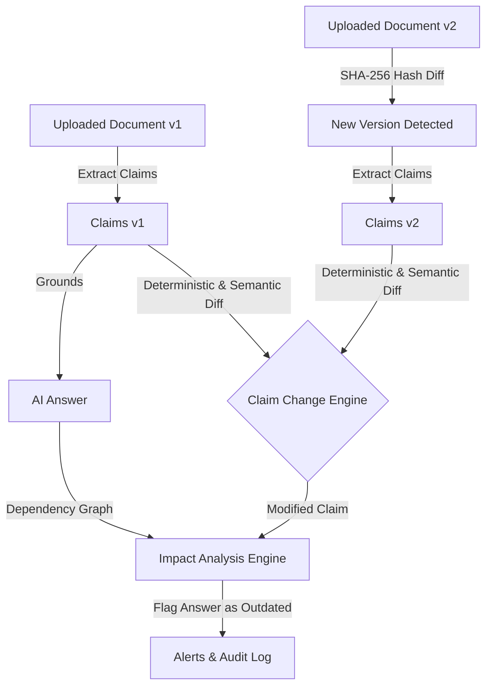

# Sovereign Black Ice

> **Local-First AI Knowledge Integrity Backend**  
> Detects document changes, extracts claims, detects semantic/factual drifts, and traces their impact on historical AI-generated answers without relying on external cloud APIs.

---

## 1. Overview & Architecture

### Core Problem
Enterprise and compliance AI systems rely heavily on documents (HR policies, manuals, contracts). When documents change, AI systems silently generate outdated answers. **Sovereign Black Ice** provides a deterministic knowledge integrity system that:
1. Tracks document versions via immutable SHA-256 snapshots.
2. Extracts verifiable facts, rules, and policy statements as structured claims.
3. Performs claim diffing (added, removed, modified, uncertain).
4. Links AI answers directly to exact document versions and evidence chunks.
5. Uses graph dependency analysis (NetworkX) to flag affected answers and alert users.



---

## 2. Directory Structure

```
backend/
├── app/
│   ├── __init__.py
│   ├── main.py                  # FastAPI application entry point
│   ├── core/
│   │   ├── config.py            # Pydantic Settings & environment variables
│   │   ├── logging_config.py    # Structured logging
│   │   └── exceptions.py        # Centralized exceptions & global handlers
│   ├── database/
│   │   ├── database.py          # SQLAlchemy 2.x engine, session, & WAL pragmas
│   │   ├── models.py            # 8 core relational entities
│   │   └── schemas.py           # Pydantic v2 schemas
│   ├── api/
│   │   ├── dependencies.py      # Dependency injection (DB session, settings)
│   │   └── routes/
│   │       └── health.py        # /health and /api/v1/system/status
│   ├── services/                # Business logic (to be expanded in Phases 2-5)
│   ├── repositories/            # Data access layer
│   └── utils/                   # File & text utilities
├── data/
│   └── database.db              # Local SQLite database
├── storage/
│   ├── documents/               # Immutable raw uploaded files
│   ├── chroma/                  # ChromaDB vector store
│   └── backups/                 # Exported data backups
├── tests/
│   └── test_health.py           # Phase 1 test suite
├── scripts/
│   └── check_environment.py    # System & environment diagnostic script
├── .env.example                 # Environment configuration template
├── .env                         # Active environment configuration
├── .gitignore                   # Git ignore rules
└── requirements.txt             # Pinned project dependencies
```

---

## 3. Quick Start (Windows PowerShell)

### Step 1: Clone or Navigate to the Workspace
```powershell
cd "c:\Users\Adarsh Dutta\Desktop\BLACKICE\backend"
```

### Step 2: Set Up Virtual Environment
```powershell
# Create virtual environment
python -m venv .venv

# Activate virtual environment
.\.venv\Scripts\Activate.ps1
```

*(If PowerShell script execution is restricted, run: `Set-ExecutionPolicy -ExecutionPolicy RemoteSigned -Scope CurrentUser`)*

### Step 3: Install Dependencies
```powershell
pip install -r requirements.txt
```

### Step 4: Run Environment Diagnostics
```powershell
python scripts\check_environment.py
```

### Step 5: Start the Backend Server
```powershell
uvicorn app.main:app --host 127.0.0.1 --port 8000 --reload
```

---

## 4. Verifying Phase 1 Endpoints

### 1. Interactive Swagger Documentation
Open your browser and navigate to:
- **Swagger UI**: [http://127.0.0.1:8000/docs](http://127.0.0.1:8000/docs)
- **ReDoc**: [http://127.0.0.1:8000/redoc](http://127.0.0.1:8000/redoc)

### 2. Basic Health Check
```powershell
Invoke-RestMethod -Uri "http://127.0.0.1:8000/health"
```
**Expected Response:**
```json
{
  "status": "ok",
  "app_name": "Sovereign Black Ice",
  "version": "0.1.0",
  "timestamp": "2026-09-26T14:40:44.673172Z"
}
```

### 3. Detailed System Diagnostics
```powershell
Invoke-RestMethod -Uri "http://127.0.0.1:8000/api/v1/system/status"
```
**Expected Response:**
```json
{
  "app_name": "Sovereign Black Ice",
  "environment": "development",
  "status": "running_local_without_ai",
  "database": {
    "status": "connected",
    "message": "SQLite database is accessible with foreign key and WAL support."
  },
  "ollama": {
    "status": "disconnected",
    "message": "Local Ollama is currently unreachable. Start it with 'ollama serve' for AI reasoning."
  },
  "chromadb": {
    "status": "connected",
    "message": "Local ChromaDB vector storage is initialized and ready."
  },
  "configured_models": {
    "llm_model": "llama3.2:3b",
    "embedding_model": "all-minilm",
    "ollama_base_url": "http://localhost:11434"
  }
}
```

---

## 5. Running Automated Tests

Run automated tests using `pytest`:
```powershell
pytest -v
```

All 35 automated tests will execute and pass:
- `test_demo_e2e.py`:
  - Full Phase 1–6 end-to-end integration lifecycle test.
  - Multi-version ingestion, chunking, claim extraction, grounded Q&A, graph traversal, selective answer flagging, and alert resolution.
- `test_impact_analysis.py`:
  - NetworkX dependency graph topology and relationship validation (`HAS_VERSION`, `CONTAINS_CHUNK`, `CONTAINS_CLAIM`, `GROUNDS`).
  - Selective impact tracing: affected answer (reimbursement window updated from 30 to 15 days) flagged as `potentially_outdated` with alert created; unaffected answer (annual leave) remains `current` with zero alerts.
  - Alert resolution lifecycle (`PATCH /api/v1/alerts/{id}/resolve`) and unreviewed count tracking.
- `test_rag.py`:
  - Chunk indexing into SQLite and ChromaDB vector store.
  - Semantic similarity search with document/version filtering.
  - Strict grounded question answering with version-specific evidence citations.
  - Extractive fallback and live Ollama model tests.
- `test_chunking.py` & `test_vector_store.py`:
  - Structure-aware chunking preserving page tags and sentence boundaries.
  - ChromaDB upsert, query, and metadata filtering.
- `test_claim_extraction.py` & `test_claim_comparison.py`:
  - Structured claim extraction via Ollama JSON schema and heuristic regex fallback.
  - Change classification across added, removed, modified, and uncertain categories.
- `test_documents.py`, `test_versions.py`, & `test_health.py`:
  - Document management, PyMuPDF extraction, SHA-256 versioning, duplicate detection, and health status diagnostics.

---

## 6. Implementation Checklist

- [x] **Phase 1: Foundation**
  - [x] Project directory structure
  - [x] Virtual environment & dependencies installed
  - [x] Pydantic Settings configuration (`.env.example`, `.env`)
  - [x] SQLite connection with WAL & foreign key enforcement
  - [x] 8 SQLAlchemy base models (`Document`, `DocumentVersion`, `Claim`, `ClaimChange`, `EvidenceChunk`, `Answer`, `AnswerEvidence`, `Alert`)
  - [x] Structured logging & centralized exception handling
  - [x] Health check (`/health`) and System status (`/api/v1/system/status`) endpoints
  - [x] Automated tests with pytest (100% passing)
  - [x] Live ASGI verification with Uvicorn
- [x] **Phase 2: Document Management**
  - [x] Document upload REST APIs (`POST /api/v1/documents/upload`, `POST /api/v1/documents/{document_id}/versions`)
  - [x] Text extraction for TXT (UTF-8, Latin-1 fallback) & PDF (PyMuPDF)
  - [x] Detection and rejection of empty/image-only PDFs
  - [x] SHA-256 integrity calculation and duplicate detection
  - [x] Immutable version snapshots on local disk and SQLite
  - [x] Safe version reversion without database constraint violations
  - [x] Full version history and extracted text endpoints (`GET /api/v1/documents/{id}/versions/{version_id}/text`)
  - [x] Safe deletion API (`DELETE /api/v1/documents/{document_id}`)
  - [x] Automated test suite passing (13/13 tests)
- [x] **Phase 3: Claims and Version Comparison**
  - [x] Local LLM structured claim extraction via Ollama (`llama3.2:3b`) with structured JSON schema
  - [x] High-precision deterministic heuristic fallback for offline environments and automated CI
  - [x] Neuro-symbolic extraction validator ensuring zero missed policy rules across paragraphs
  - [x] Structured claim persistence in SQLite (`Claim` model) with subject, predicate, value, unit, category, confidence, and source location
  - [x] Cross-version claim comparison engine (`ClaimComparisonService`)
  - [x] Multi-factor similarity analysis with generic boilerplate stopword filtering
  - [x] Detection and classification of all 5 change states: `added`, `removed`, `modified`, `unchanged`, `uncertain`
  - [x] Compliance flagging (`human_review_required=True`) on uncertain or structurally ambiguous policy changes
  - [x] Granular source references preserved across all claim diffs (`source_reference_old`, `source_reference_new`)
  - [x] REST API endpoints:
    - `POST /api/v1/documents/{document_id}/versions/{version_id}/claims/extract`
    - `GET /api/v1/documents/{document_id}/versions/{version_id}/claims`
    - `GET /api/v1/documents/{document_id}/claims`
    - `GET /api/v1/claims/{claim_id}`
    - `GET /api/v1/documents/{document_id}/compare`
    - `POST /api/v1/documents/{document_id}/compare`
    - `GET /api/v1/documents/{document_id}/changes`
  - [x] Automated test suite passing (22/22 tests across Phase 1, 2, and 3)
- [x] **Phase 4: Local AI and RAG**
  - [x] Local ChromaDB vector store integration (`VectorStoreService`) with persistent storage and cosine indexing
  - [x] Structure and page-aware document chunking (`ChunkingService`) with paragraph boundary preservation and overlap
  - [x] SQLite `evidence_chunks` storage mapped 1:1 with ChromaDB vector embeddings
  - [x] Semantic vector search (`POST /api/v1/search`) with document and version scoping
  - [x] Grounded question answering (`POST /api/v1/qa/ask`) powered by local Ollama (`llama3.2:3b`)
  - [x] Strict grounding prompts preventing hallucinations and requiring explicit version citations
  - [x] Deterministic extractive grounded fallback for offline environments and CI
  - [x] Persistent answer and evidence relationship tracking (`Answer` and `AnswerEvidence` records) linking answers to exact version, page, and chunk IDs
  - [x] REST API endpoints:
    - `POST /api/v1/documents/{document_id}/versions/{version_id}/index`
    - `GET /api/v1/documents/{document_id}/versions/{version_id}/chunks`
    - `POST /api/v1/search`
    - `POST /api/v1/qa/ask`
    - `GET /api/v1/answers`
    - `GET /api/v1/answers/{answer_id}`
  - [x] Automated test suite passing (31/31 tests across Phase 1, 2, 3, and 4)
- [x] **Phase 5: Dependency Graph and Impact Analysis**
  - [x] NetworkX directed dependency graph (`nx.DiGraph`) modeling `Document`, `Version`, `Chunk`, `Claim`, `Answer`, and `ClaimChange` entities
  - [x] Typed edge relationships: `HAS_VERSION`, `CONTAINS_CHUNK`, `CONTAINS_CLAIM`, `GROUNDS`, and `MODIFIES`
  - [x] Full graph topology JSON export (`GET /api/v1/impact/graph`) with node counts, edge relationships, and entity metadata for frontend visualizers
  - [x] Claim change impact tracing engine (`ImpactService`) connecting modified, removed, and uncertain claims to historical AI answers
  - [x] Dual-mode impact reachability: graph descendant traversal + semantic chunk citation matching
  - [x] Selective precision: affected answers flagged as `status="potentially_outdated"` and `human_review_required=True` while unaffected answers remain `status="current"` with zero false-positive alerts
  - [x] Persistent audit alerts in SQLite (`Alert` model) with severity rating (`critical`, `high`, `medium`, `low`), human-readable diff explanations, and resolution tracking
  - [x] Automated pipeline trigger: new version uploads automatically run chunking, claim extraction, comparison diffing, and impact analysis
  - [x] REST API endpoints:
    - `POST /api/v1/impact/analyze`
    - `GET /api/v1/impact/graph`
    - `GET /api/v1/alerts`
    - `GET /api/v1/alerts/{alert_id}`
    - `PATCH /api/v1/alerts/{alert_id}/resolve`
    - `GET /api/v1/answers/{answer_id}/alerts`
  - [x] Automated test suite passing (35/35 tests across Phase 1, 2, 3, 4, 5, and 6)
- [x] **Phase 6: Final Integration & Demo**
  - [x] End-to-end integration test (`tests/test_demo_e2e.py`) verifying full 10-step lifecycle across all 6 phases
  - [x] Automated test suite passing 100% (35/35 tests passing)
  - [x] Automated demo execution script (`scripts/run_demo.py`) with support for both in-process and live HTTP execution
  - [x] Fixed all integration gaps and missing import dependencies across services
  - [x] Complete Windows PowerShell command cookbook documenting exact commands for every API

---

## 7. Windows PowerShell API Cookbook

All commands below are formatted for native **Windows PowerShell** using `Invoke-RestMethod` and `curl.exe`.

### 1. Server & Test Execution
```powershell
# Activate Virtual Environment
cd "c:\Users\Adarsh Dutta\Desktop\BLACKICE\backend"
.\.venv\Scripts\Activate.ps1

# Run Full Automated Test Suite (35 tests)
pytest -v

# Run End-to-End Demo Script (In-Process)
python scripts\run_demo.py

# Start ASGI Server
uvicorn app.main:app --host 127.0.0.1 --port 8000 --reload

# Run End-to-End Demo Script (Against Live Server)
python scripts\run_demo.py --live
```

### 2. System Diagnostics & Health
```powershell
# Basic Health
Invoke-RestMethod -Uri "http://127.0.0.1:8000/health" -Method GET

# Comprehensive Status (SQLite, ChromaDB, Ollama)
Invoke-RestMethod -Uri "http://127.0.0.1:8000/api/v1/system/status" -Method GET
```

### 3. Document Management & Versioning
```powershell
# Upload New Document (Establish Version 1)
$form = @{
    file = Get-Item -Path "sample_policy.txt"
    document_name = "Corporate Travel Policy"
}
$docResp = Invoke-RestMethod -Uri "http://127.0.0.1:8000/api/v1/documents/upload" -Method POST -Form $form
$docId = $docResp.document.id
$v1Id = $docResp.version.id

# Upload Revised Version (Version 2)
$formV2 = @{
    file = Get-Item -Path "sample_policy_v2.txt"
}
$v2Resp = Invoke-RestMethod -Uri "http://127.0.0.1:8000/api/v1/documents/$docId/versions" -Method POST -Form $formV2
$v2Id = $v2Resp.version.id

# List All Documents
Invoke-RestMethod -Uri "http://127.0.0.1:8000/api/v1/documents" -Method GET

# Get Document Details with Version History
Invoke-RestMethod -Uri "http://127.0.0.1:8000/api/v1/documents/$docId" -Method GET

# Get Extracted Text for a Specific Version
Invoke-RestMethod -Uri "http://127.0.0.1:8000/api/v1/documents/$docId/versions/$v1Id/text" -Method GET
```

### 4. Claims & Cross-Version Comparison
```powershell
# Extract Structured Claims for a Version
Invoke-RestMethod -Uri "http://127.0.0.1:8000/api/v1/documents/$docId/versions/$v1Id/claims/extract" -Method POST

# List Extracted Claims for a Version
Invoke-RestMethod -Uri "http://127.0.0.1:8000/api/v1/documents/$docId/versions/$v1Id/claims" -Method GET

# Compare Claims Between Version 1 and Version 2
Invoke-RestMethod -Uri "http://127.0.0.1:8000/api/v1/documents/$docId/compare?old_version_id=$v1Id&new_version_id=$v2Id" -Method GET

# List All Historical Changes for a Document
Invoke-RestMethod -Uri "http://127.0.0.1:8000/api/v1/documents/$docId/changes" -Method GET
```

### 5. Semantic Search & Grounded Question Answering (RAG)
```powershell
# Semantic Similarity Search across Chunks
$searchBody = @{
    query = "reimbursement submission window"
    document_id = $docId
    top_k = 3
} | ConvertTo-Json
Invoke-RestMethod -Uri "http://127.0.0.1:8000/api/v1/search" -Method POST -ContentType "application/json" -Body $searchBody

# Ask Grounded Question (Generates Answer with Exact Version & Evidence Citations)
$qaBody = @{
    question = "What is the deadline for submitting travel expense claims?"
    document_id = $docId
    version_id = $v1Id
} | ConvertTo-Json
$ansResp = Invoke-RestMethod -Uri "http://127.0.0.1:8000/api/v1/qa/ask" -Method POST -ContentType "application/json" -Body $qaBody
$ansId = $ansResp.id

# Get Historical Answer Details with Evidence Items
Invoke-RestMethod -Uri "http://127.0.0.1:8000/api/v1/answers/$ansId" -Method GET
```

### 6. Dependency Graph, Impact Analysis, & Alerts
```powershell
# Export NetworkX Directed Dependency Graph Topology
Invoke-RestMethod -Uri "http://127.0.0.1:8000/api/v1/impact/graph" -Method GET

# Trigger Impact Analysis for Document Version
$impactBody = @{
    document_id = $docId
    old_version_id = $v1Id
    new_version_id = $v2Id
} | ConvertTo-Json
Invoke-RestMethod -Uri "http://127.0.0.1:8000/api/v1/impact/analyze" -Method POST -ContentType "application/json" -Body $impactBody

# List Impact Alerts
Invoke-RestMethod -Uri "http://127.0.0.1:8000/api/v1/alerts?status=unreviewed" -Method GET

# Get Alerts for a Specific Answer
Invoke-RestMethod -Uri "http://127.0.0.1:8000/api/v1/answers/$ansId/impact" -Method GET

# Resolve an Impact Alert
$resolveBody = @{
    status = "resolved"
} | ConvertTo-Json
Invoke-RestMethod -Uri "http://127.0.0.1:8000/api/v1/alerts/{ALERT_ID}/resolve" -Method PATCH -ContentType "application/json" -Body $resolveBody
```


